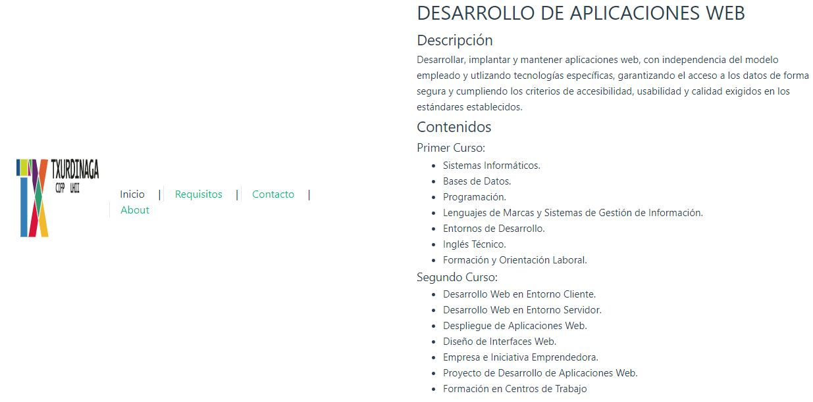
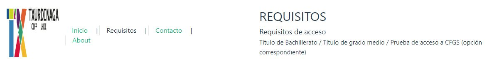
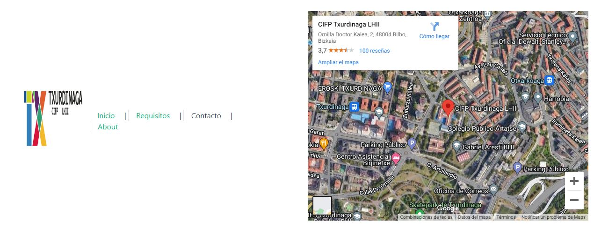

### Crea una app que utilice rutas y haga lo siguiente:
Queremos hacer una páginaweb para publicitar el ciclo de Desarrollo de Aplicaciones Web del CIFP Txurdinaga LHII
1. La página tendrá 4 rutas posibles: Inicio, Requisitos, Contacto, About
    1. Inicio: Nos da información sobre el ciclo y los módulos a cursar en 1º curso y 2º curso
    2. Requisitos: Nos da información sobre los requisitos de acceso al ciclo
    3. Contacto: Nos muestra nuestra ubicación a partir de Google Maps.
    4. About: Página About

