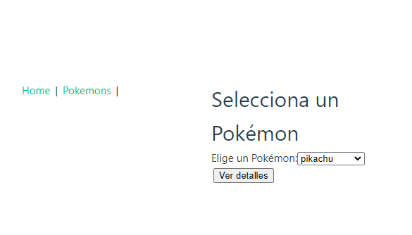
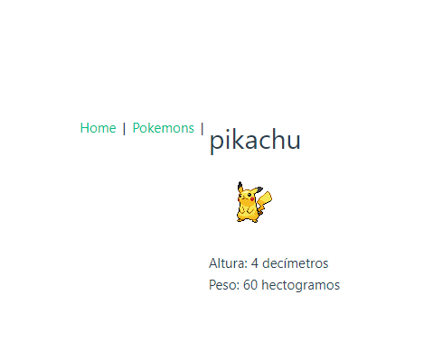

# Ejercicio 8 RUTAS Pikachu

La app dos enlaces de navegación Home y Pokemon

### Crea una app que usando la API https://pokeapi.co/ haga lo siguiente:
1. Desde home se visualzará un slider con fotos de pokemons.
2. Al pulsar el enlace del menú "pokemon" se accederá a una vista diferente en la que aparecerá un select con todos los pokemons, y una vez seleccinado pulsando el botón nos mostrará información del pokemon seleccionado: altura y peso. Para ello enviaremos por la ruta el nombre del pokemon y en la misma 
2. .

